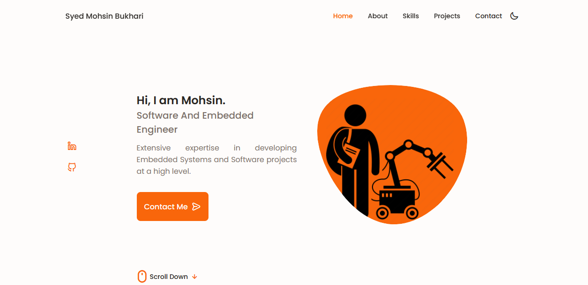

# 🚀 Syed Mohsin's Portfolio

**Explore My Portfolio:** [Personal Portfolio](https://mayourbukhari.github.io/Personal-Portfolio/)

### Landing Page Light

### Landing Page Dark

## 🌟 Overview

Welcome to the vibrant world of my portfolio! Here, creativity meets technology, and I'm excited to share my journey with you. The website is not just a collection of code; it's a canvas where ideas come to life.

## 🚀 Features & Credits

- **Modern Design:** Inspired by [Bedimcode](https://github.com/bedimcode), the website boasts a sleek and modern design that captivates visitors.

- **Interactive Resume:** Crafted on [FlowCV](https://flowcv.com/), my resume comes alive with interactive elements, providing a dynamic snapshot of my skills and experiences.

- **Expressive Alerts:** Bid farewell to ordinary alerts! Thanks to [SweetAlert](https://sweetalert.js.org), notifications are now an experience, adding a touch of personality.

- **Favicon Magic:** The charming favicon is courtesy of [favicon.io](https://favicon.io/favicon-generator/), where pixels turn into a distinctive symbol.

- **Engaging Content:** Videos from [YouTube](https://www.youtube.com) and presentations from [Beautiful.ai](https://www.beautiful.ai) bring an extra layer of interactivity.

- **Insights with Google Analytics:** Dive into the metrics! The [Google Analytics](https://analytics.google.com) integration helps me understand how visitors interact with my portfolio.

- **Seamless Scheduling:** [Calendly](https://calendly.com/) brings us closer. Schedule a meeting effortlessly, and let's discuss exciting opportunities.

## 🛠️ Technologies Used

- HTML
- CSS
- JavaScript

## 💡 Special Thanks

- A shoutout to the creative minds at [SweetAlert](https://sweetalert.js.org) for transforming alerts into a delightful experience.
- [favicon.io](https://favicon.io/favicon-generator/) for turning imagination into a tiny, distinctive icon.

### Get in Touch 
Your feedback means the world to me! Reach out via

Let's connect, collaborate, and create something extraordinary.

Thank you for visiting, and enjoy your journey through my digital realm! 🌐
